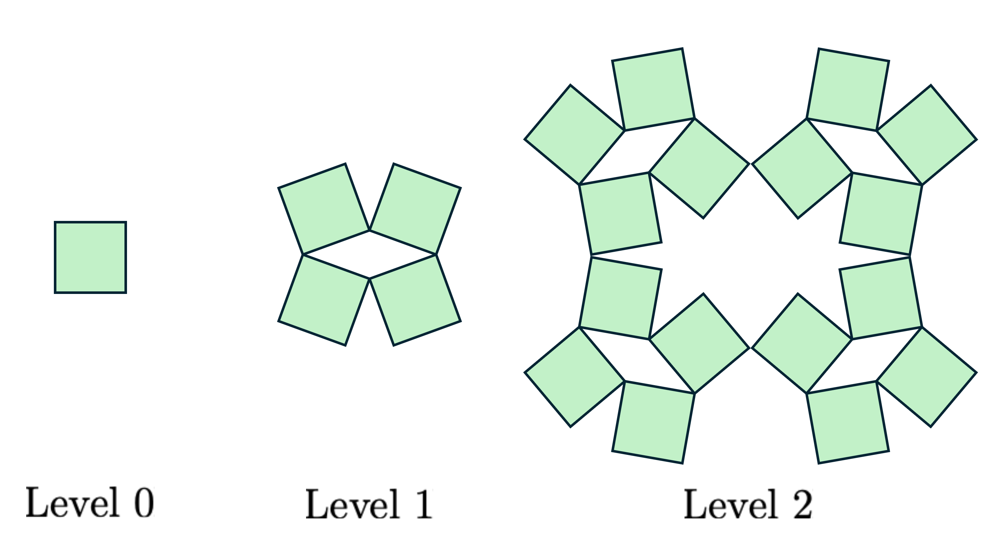
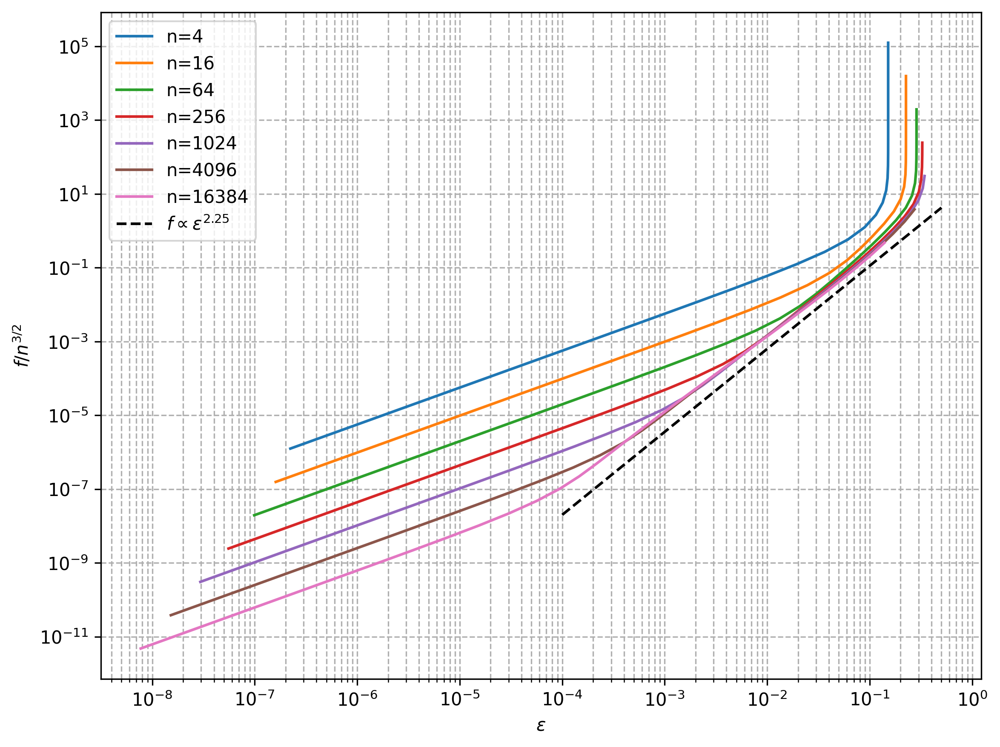

# Fractal Network

Simulación numérica de la respuesta mecánica de una **red auxética jerárquica** formada por cuadrados rígidos conectados mediante bisagras rotables.

El modelo reduce una estructura de `N` niveles a `N` ángulos, calcula su geometría de manera recursiva y minimiza la energía a fuerza impuesta. La implementación principal utiliza el algoritmo **FIRE** (*Fast Inertial Relaxation Engine*) y escala linealmente con el número de niveles, lo que permite estudiar sistemas de hasta 16 384 variables.

<p align="center">
  
</p>

## Características

- Construcción geométrica recursiva de redes auxéticas de múltiples niveles.
- Energía elástica con dos familias de bisagras, `phi-` y `phi+`.
- Configuraciones naturales compatibles y pesos efectivos configurables por nivel.
- Minimización a fuerza impuesta mediante FIRE o gradiente conjugado.
- Continuación numérica: cada valor de carga comienza desde la solución anterior.
- Exportación de muestras y estadísticos resumidos en formato CSV.
- Pruebas de gradientes, convergencia, validación de entradas y sistemas grandes.

## Modelo

Cada nivel jerárquico está descrito por un ángulo `theta_i`. Las deformaciones reducidas de sus dos familias de bisagras son

```text
r_i^- = theta_i - sum(theta_j, j < i)
r_i^+ = theta_i + sum(theta_j, j < i)
```

La energía suma los residuos cuadráticos de ambas familias respecto de una configuración natural. El peso efectivo `w_i` incorpora la rigidez microscópica y la multiplicidad geométrica del nivel, proporcional a `4^(N-i)`.

Bajo una carga adimensional `lambda`, el código minimiza

```text
H(theta) = E(theta) - lambda * L_x(theta)
```

y obtiene la extensión, la deformación de ingeniería, la fracción de enderezamiento, el área y las dimensiones características de la red.

La formulación completa está disponible en [`doc/main_v3.pdf`](doc/main_v3.pdf) y en su fuente [`doc/main_v3.tex`](doc/main_v3.tex).

## Instalación

Se recomienda Python 3.10 o posterior.

```bash
git clone https://github.com/Poss9368/Fractal_network.git
cd Fractal_network

python3 -m venv .venv
source .venv/bin/activate
python3 -m pip install --upgrade pip
python3 -m pip install numpy scipy numba matplotlib pandas
```

`ffmpeg` sólo es necesario para exportar animaciones desde Matplotlib; no se requiere para ejecutar las simulaciones ni las pruebas.

## Uso rápido

Ejecuta los comandos desde la raíz del repositorio.

### Simular la respuesta fuerza-deformación

```bash
python3 -m src.nlevel.main --sizes 4 16 64 256 --solver fire
```

El solucionador FIRE es el predeterminado. Para comparar con el método anterior:

```bash
python3 -m src.nlevel.main --sizes 4 16 --solver cg
```

También se puede elegir el directorio de salida:

```bash
python3 -m src.nlevel.main \
  --sizes 1024 4096 16384 \
  --solver fire \
  --output-dir src/nlevel/results_fire
```

Opciones disponibles:

| Opción | Descripción | Valor predeterminado |
|---|---|---|
| `--sizes` | Número de ángulos o niveles por simulación | `4 16 64 256 1024` |
| `--solver` | Optimizador: `fire` o `cg` | `fire` |
| `--processes` | Número de procesos | `1` |
| `--output-dir` | Directorio para los CSV | `src/nlevel/results` |

El barrido predeterminado utiliza 34 cargas logarítmicas entre `1e-5` y `1e6`, además del estado inicial con carga cero.

### Graficar los resultados FIRE incluidos

```bash
python3 src/nlevel/results_fire/plot_output_f-e.py
```

El gráfico se guarda en `src/nlevel/results_fire/force_vs_epsilon.png`.

<p align="center">
  
</p>

### Visualizar la geometría

```bash
python3 -m src.nlevel.plot_nlevels
python3 src/1level/plot_network_1level.py
```

## Archivos de salida

Por cada tamaño `N`, la simulación genera dos archivos:

- `N_angles_samples.csv`: resultados individuales por semilla y por carga.
- `N_angles_output.csv`: media, mediana, desviación estándar, error estándar y cuartiles de las observables principales.

Entre las columnas se incluyen `lambda`, `strain`, `extension_x`, `straightening_fraction`, `length_x`, `area`, `rest_length` y `geometric_max_length`.

El repositorio contiene resultados de referencia para tamaños entre 4 y 16 384 ángulos en [`src/nlevel/results_fire`](src/nlevel/results_fire).

## Pruebas

```bash
python3 -m unittest src.nlevel.test_dynamic src.nlevel.test_fire -v
```

Las pruebas comparan gradientes analíticos con diferencias finitas, contrastan FIRE con BFGS en sistemas pequeños y comprueban convergencia hasta 16 384 variables. La prueba completa puede tardar algunos segundos por la compilación inicial de Numba.

## Estructura del repositorio

```text
.
├── doc/
│   ├── main_v3.tex                 # Formulación teórica actual
│   ├── main_v3.pdf
│   └── figures/                    # Figuras del manuscrito
├── documentation/                  # Notas y documentos complementarios
├── src/
│   ├── 1level/                     # Visualización de un nivel
│   └── nlevel/
│       ├── dynamic.py              # Energía, geometría y API de optimización
│       ├── fire.py                 # Implementación escalable del algoritmo FIRE
│       ├── main.py                 # Barrido de carga y exportación de CSV
│       ├── benchmark_fire.py       # Benchmark reproducible de FIRE
│       ├── plot_nlevels.py         # Construcción y visualización geométrica
│       ├── test_dynamic.py
│       ├── test_fire.py
│       ├── results/                # Resultados de tamaños pequeños
│       └── results_fire/           # Resultados FIRE hasta N = 16 384
└── old/                            # Implementaciones y experimentos históricos
```

## Benchmark de FIRE

Para repetir el barrido de parámetros descrito en [`src/nlevel/FIRE.md`](src/nlevel/FIRE.md):

```bash
python3 -m src.nlevel.benchmark_fire \
  --sizes 4096 16384 \
  --output fire_benchmark.json
```

El benchmark excluye de la medición la primera compilación de Numba y guarda convergencia, iteraciones, tiempo y energía para cada configuración ensayada. Los tiempos dependen del equipo.

## Estado del proyecto

El desarrollo activo está en `src/nlevel`. El directorio `old/` conserva variantes anteriores y experimentos para trazabilidad, pero no forma parte del flujo recomendado.

La convergencia numérica identifica un punto estacionario de la rama seguida por continuación; no constituye una certificación de mínimo global.
